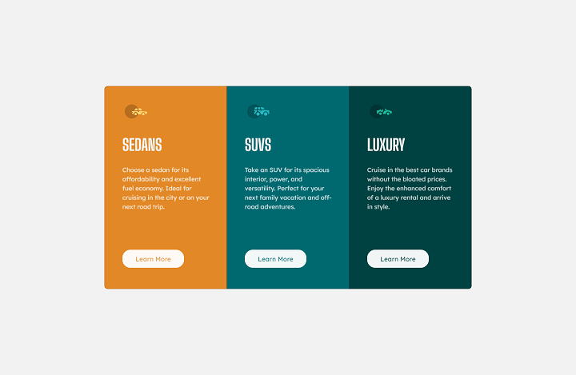

# Frontend Mentor - 3-column preview card component solution

This is a solution to the [3-column preview card component challenge on Frontend Mentor](https://www.frontendmentor.io/challenges/3column-preview-card-component-pH92eAR2-). Frontend Mentor challenges help you improve your coding skills by building realistic projects.

## Table of contents

- [Overview](#overview)
  - [The challenge](#the-challenge)
  - [Screenshot](#screenshot)
  - [Links](#links)
- [My process](#my-process)
  - [Built with](#built-with)
  - [What I learned](#what-i-learned)
  - [Continued development](#continued-development)
  - [Useful resources](#useful-resources)
- [Author](#author)
- [Acknowledgments](#acknowledgments)

## Overview

### The challenge

Users should be able to:

- View the optimal layout depending on their device's screen size
- See hover states for interactive elements

### Screenshot



### Links

- Solution URL: [https://github.com/mays21/3-column-preview-card](https://github.com/mays21/3-column-preview-card)
- Live Site URL: [https://mays21.github.io/3-column-preview-card/](https://mays21.github.io/3-column-preview-card/)

## My process

### Built with

- Semantic HTML5 markup
- CSS custom properties
- Flexbox
- Mobile-first workflow
- Bootstrap5 Grid Card
- SASS

### What I learned

```scss
.btn.card-button {
  background-color: $very-light-gray;
  color: #000;
  mix-blend-mode: screen;
  border-radius: $btn-border-radius;
  padding: 0.6rem 2rem;

  &:hover {
    background-color: transparent;
    border: solid 1px $very-light-gray;
    color: $very-light-gray;
  }
```

### Continued development

### Useful resources

## Author

- Frontend Mentor - [@mays21](https://www.frontendmentor.io/profile/mays21)

## Acknowledgments

### SASS の導入

1. npm init
1. npm install bootstrap
1. scss/custom.scss 内で

   ```
   @import "../node_modules/bootstrap/scss/bootstrap"
   ```

1. live sass compiler 拡張インストール
   1. "format": "compressed"
   1. "savePath":"/css"
